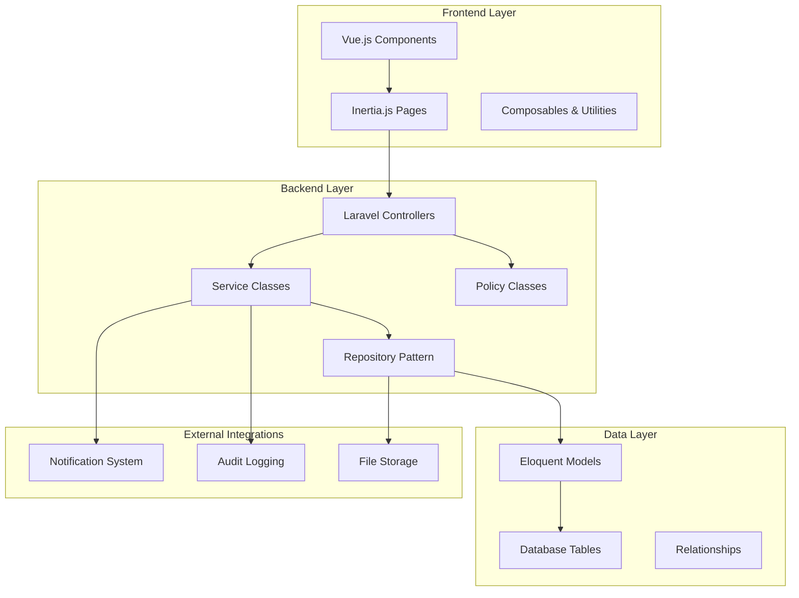
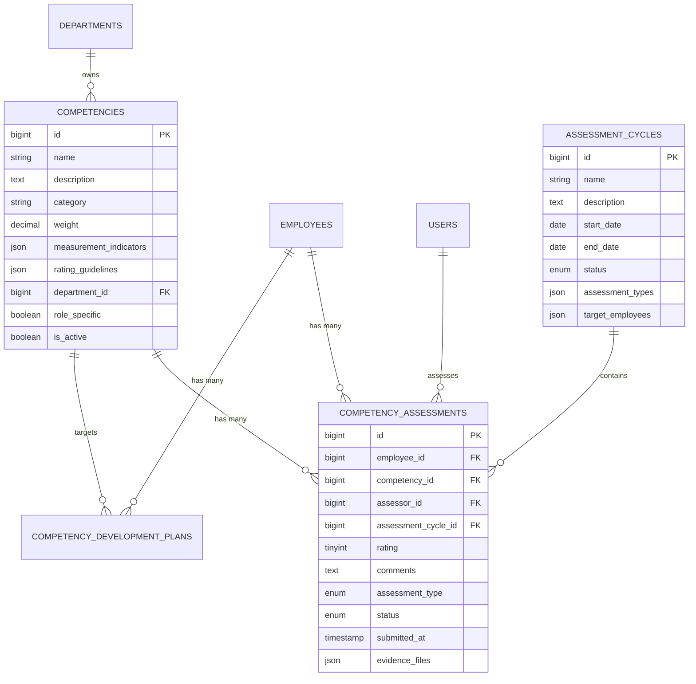

# Design Document

## Overview

The Competency Management System is designed as a comprehensive, scalable solution that integrates seamlessly with the existing Laravel/Vue.js application architecture. The system follows established patterns in the codebase, utilizing Inertia.js for seamless SPA functionality, Eloquent ORM for data management, and the existing design system components for consistent UI/UX.

The architecture supports multi-dimensional competency assessment with sophisticated analytics, role-based access control, and mobile-responsive interfaces. The design emphasizes data integrity, performance optimization, and extensibility to accommodate future organizational needs.

## Architecture

### System Architecture Overview



### Core Design Principles

1. **Consistency**: Follow existing codebase patterns and conventions
2. **Scalability**: Support large datasets and concurrent users
3. **Flexibility**: Accommodate various assessment types and organizational structures
4. **Security**: Implement robust access controls and data protection
5. **Performance**: Optimize for fast loading and responsive interactions
6. **Maintainability**: Use clear separation of concerns and modular design

## Components and Interfaces

### Backend Components

#### 1. Models and Relationships

**Enhanced Competency Model**
```php
class Competency extends Model
{
    protected $fillable = [
        'name', 'description', 'category', 'weight', 'is_active',
        'measurement_indicators', 'rating_guidelines', 'department_id',
        'role_specific', 'created_by', 'updated_by'
    ];
    
    protected $casts = [
        'measurement_indicators' => 'array',
        'rating_guidelines' => 'array',
        'is_active' => 'boolean',
        'role_specific' => 'boolean',
        'weight' => 'decimal:2'
    ];
}
```

**CompetencyAssessment Model (New)**
```php
class CompetencyAssessment extends Model
{
    protected $fillable = [
        'employee_id', 'competency_id', 'assessor_id', 'assessment_cycle_id',
        'rating', 'comments', 'assessment_type', 'status', 'submitted_at',
        'evidence_files', 'development_notes'
    ];
    
    protected $casts = [
        'evidence_files' => 'array',
        'submitted_at' => 'datetime'
    ];
}
```

**AssessmentCycle Model (New)**
```php
class AssessmentCycle extends Model
{
    protected $fillable = [
        'name', 'description', 'start_date', 'end_date', 'status',
        'assessment_types', 'target_employees', 'created_by'
    ];
    
    protected $casts = [
        'assessment_types' => 'array',
        'target_employees' => 'array',
        'start_date' => 'date',
        'end_date' => 'date'
    ];
}
```

#### 2. Service Classes

**CompetencyAssessmentService**
- Handles assessment logic and validation
- Manages assessment cycles and notifications
- Calculates competency scores and analytics
- Generates development recommendations

**CompetencyAnalyticsService**
- Processes competency data for reporting
- Generates trend analysis and comparisons
- Creates skill gap analysis
- Produces performance insights

#### 3. Controllers

**CompetencyController**
- CRUD operations for competencies
- Competency framework management
- Category and weight management

**CompetencyAssessmentController**
- Assessment creation and submission
- Assessment cycle management
- Bulk assessment operations
- Assessment approval workflows

**CompetencyAnalyticsController**
- Dashboard analytics endpoints
- Report generation
- Data export functionality
- Trend analysis APIs

### Frontend Components

#### 1. Page Components

**Competency Management Pages**
- `CompetencyIndex.vue` - Competency listing and management
- `CompetencyForm.vue` - Create/edit competency forms
- `AssessmentDashboard.vue` - Assessment overview and analytics
- `AssessmentForm.vue` - Individual assessment interface
- `AssessmentCycleManager.vue` - Cycle creation and management
- `CompetencyReports.vue` - Analytics and reporting interface

#### 2. Reusable Components

**CompetencyCard.vue**
```vue
<template>
  <DashboardWidget :title="competency.name" class="competency-card">
    <div class="competency-content">
      <div class="competency-rating">
        <RatingDisplay :rating="currentRating" :max="5" />
        <span class="rating-text">{{ ratingText }}</span>
      </div>
      <div class="competency-progress">
        <ProgressBar :value="progressPercentage" />
      </div>
      <div class="competency-actions">
        <button @click="startAssessment" class="btn-primary">
          Assess
        </button>
      </div>
    </div>
  </DashboardWidget>
</template>
```

**AssessmentForm.vue**
```vue
<template>
  <form @submit.prevent="submitAssessment" class="assessment-form">
    <div class="assessment-header">
      <h2>{{ employee.name }} - {{ competency.name }}</h2>
      <div class="assessment-context">
        <CompetencyDescription :competency="competency" />
      </div>
    </div>
    
    <div class="rating-section">
      <RatingInput 
        v-model="form.rating" 
        :guidelines="competency.rating_guidelines"
        @change="handleRatingChange"
      />
    </div>
    
    <div class="comments-section">
      <RichTextEditor 
        v-model="form.comments"
        :required="requiresComments"
        placeholder="Provide detailed feedback..."
      />
    </div>
    
    <div class="evidence-section">
      <FileUpload 
        v-model="form.evidence_files"
        accept="image/*,application/pdf"
        multiple
      />
    </div>
  </form>
</template>
```

**CompetencyAnalytics.vue**
```vue
<template>
  <div class="competency-analytics">
    <div class="analytics-grid">
      <StatsCard
        :value="averageRating"
        label="Average Rating"
        icon="chart-bar"
        variant="primary"
        :trend="ratingTrend"
      />
      
      <CompetencyRadarChart 
        :data="competencyData"
        :employee="selectedEmployee"
      />
      
      <SkillGapMatrix 
        :gaps="skillGaps"
        :departments="departments"
      />
    </div>
  </div>
</template>
```

#### 3. Specialized Components

**RatingInput.vue** - Interactive rating component with guidelines
**CompetencyRadarChart.vue** - Radar chart for competency visualization
**SkillGapMatrix.vue** - Heat map for skill gap analysis
**AssessmentTimeline.vue** - Timeline view of assessment history
**DevelopmentPlan.vue** - Individual development planning interface

## Data Models

### Database Schema

#### Competencies Table
```sql
CREATE TABLE competencies (
    id BIGINT UNSIGNED AUTO_INCREMENT PRIMARY KEY,
    name VARCHAR(255) NOT NULL,
    description TEXT,
    category VARCHAR(100) NOT NULL,
    weight DECIMAL(3,2) DEFAULT 1.00,
    measurement_indicators JSON,
    rating_guidelines JSON,
    department_id BIGINT UNSIGNED NULL,
    role_specific BOOLEAN DEFAULT FALSE,
    is_active BOOLEAN DEFAULT TRUE,
    created_by BIGINT UNSIGNED,
    updated_by BIGINT UNSIGNED,
    created_at TIMESTAMP NULL DEFAULT NULL,
    updated_at TIMESTAMP NULL DEFAULT NULL,
    
    INDEX idx_category (category),
    INDEX idx_department (department_id),
    INDEX idx_active (is_active),
    FOREIGN KEY (department_id) REFERENCES departments(id),
    FOREIGN KEY (created_by) REFERENCES users(id),
    FOREIGN KEY (updated_by) REFERENCES users(id)
);
```

#### Competency Assessments Table
```sql
CREATE TABLE competency_assessments (
    id BIGINT UNSIGNED AUTO_INCREMENT PRIMARY KEY,
    employee_id BIGINT UNSIGNED NOT NULL,
    competency_id BIGINT UNSIGNED NOT NULL,
    assessor_id BIGINT UNSIGNED NOT NULL,
    assessment_cycle_id BIGINT UNSIGNED NULL,
    rating TINYINT UNSIGNED NOT NULL CHECK (rating BETWEEN 1 AND 5),
    comments TEXT,
    assessment_type ENUM('self', 'manager', 'peer', '360') NOT NULL,
    status ENUM('draft', 'submitted', 'approved', 'rejected') DEFAULT 'draft',
    submitted_at TIMESTAMP NULL,
    evidence_files JSON,
    development_notes TEXT,
    created_at TIMESTAMP NULL DEFAULT NULL,
    updated_at TIMESTAMP NULL DEFAULT NULL,
    
    INDEX idx_employee (employee_id),
    INDEX idx_competency (competency_id),
    INDEX idx_assessor (assessor_id),
    INDEX idx_cycle (assessment_cycle_id),
    INDEX idx_type (assessment_type),
    INDEX idx_status (status),
    INDEX idx_submitted (submitted_at),
    UNIQUE KEY unique_assessment (employee_id, competency_id, assessor_id, assessment_cycle_id),
    FOREIGN KEY (employee_id) REFERENCES employees(id),
    FOREIGN KEY (competency_id) REFERENCES competencies(id),
    FOREIGN KEY (assessor_id) REFERENCES users(id),
    FOREIGN KEY (assessment_cycle_id) REFERENCES assessment_cycles(id)
);
```

#### Assessment Cycles Table
```sql
CREATE TABLE assessment_cycles (
    id BIGINT UNSIGNED AUTO_INCREMENT PRIMARY KEY,
    name VARCHAR(255) NOT NULL,
    description TEXT,
    start_date DATE NOT NULL,
    end_date DATE NOT NULL,
    status ENUM('planned', 'active', 'completed', 'cancelled') DEFAULT 'planned',
    assessment_types JSON NOT NULL,
    target_employees JSON,
    notification_settings JSON,
    created_by BIGINT UNSIGNED NOT NULL,
    created_at TIMESTAMP NULL DEFAULT NULL,
    updated_at TIMESTAMP NULL DEFAULT NULL,
    
    INDEX idx_status (status),
    INDEX idx_dates (start_date, end_date),
    INDEX idx_creator (created_by),
    FOREIGN KEY (created_by) REFERENCES users(id)
);
```

#### Competency Development Plans Table
```sql
CREATE TABLE competency_development_plans (
    id BIGINT UNSIGNED AUTO_INCREMENT PRIMARY KEY,
    employee_id BIGINT UNSIGNED NOT NULL,
    competency_id BIGINT UNSIGNED NOT NULL,
    current_rating TINYINT UNSIGNED,
    target_rating TINYINT UNSIGNED NOT NULL,
    target_date DATE,
    development_actions JSON,
    progress_notes TEXT,
    status ENUM('active', 'completed', 'paused', 'cancelled') DEFAULT 'active',
    created_by BIGINT UNSIGNED,
    created_at TIMESTAMP NULL DEFAULT NULL,
    updated_at TIMESTAMP NULL DEFAULT NULL,
    
    INDEX idx_employee (employee_id),
    INDEX idx_competency (competency_id),
    INDEX idx_status (status),
    INDEX idx_target_date (target_date),
    FOREIGN KEY (employee_id) REFERENCES employees(id),
    FOREIGN KEY (competency_id) REFERENCES competencies(id),
    FOREIGN KEY (created_by) REFERENCES users(id)
);
```

### Model Relationships



## Error Handling

### Validation Rules

**Competency Validation**
- Name: Required, unique within department, max 255 characters
- Category: Required, must be from predefined list
- Weight: Numeric, between 0.1 and 5.0
- Measurement indicators: Valid JSON array
- Rating guidelines: Valid JSON with 5 rating levels

**Assessment Validation**
- Rating: Required, integer between 1 and 5
- Comments: Required for ratings ≤ 2 or ≥ 4, max 2000 characters
- Assessment type: Must be valid enum value
- Employee-Competency-Assessor-Cycle combination must be unique

### Error Response Format

```json
{
  "success": false,
  "message": "Validation failed",
  "errors": {
    "rating": ["The rating field is required."],
    "comments": ["Comments are required for ratings below 3."]
  },
  "error_code": "VALIDATION_ERROR"
}
```

### Exception Handling Strategy

1. **Validation Exceptions**: Return structured error responses with field-specific messages
2. **Authorization Exceptions**: Return 403 with clear permission requirements
3. **Database Exceptions**: Log detailed errors, return generic user-friendly messages
4. **File Upload Exceptions**: Handle size limits, file type restrictions
5. **Assessment Cycle Exceptions**: Handle date conflicts, status transitions

## Testing Strategy

### Unit Testing

**Model Tests**
- Competency model relationships and scopes
- Assessment validation rules
- Calculation methods for analytics
- Data casting and attribute handling

**Service Tests**
- CompetencyAssessmentService methods
- Analytics calculation accuracy
- Notification triggering logic
- Development plan generation

### Integration Testing

**Controller Tests**
- API endpoint responses
- Authentication and authorization
- Data persistence and retrieval
- File upload handling

**Feature Tests**
- Complete assessment workflows
- Assessment cycle management
- Report generation processes
- Notification delivery

### Frontend Testing

**Component Tests**
- Rating input component behavior
- Form validation and submission
- Chart rendering with various data sets
- Responsive design across devices

**E2E Tests**
- Complete assessment submission flow
- Multi-user assessment scenarios
- Report generation and export
- Mobile device compatibility

### Performance Testing

**Load Testing**
- Concurrent assessment submissions
- Large dataset analytics queries
- File upload performance
- Dashboard loading times

**Database Performance**
- Query optimization for analytics
- Index effectiveness
- Bulk operation performance
- Data archival strategies

### Security Testing

**Access Control Testing**
- Role-based permission enforcement
- Data isolation between departments
- Assessment visibility rules
- Audit trail integrity

**Data Protection Testing**
- Input sanitization
- SQL injection prevention
- File upload security
- Data export controls

## Implementation Considerations

### Performance Optimization

1. **Database Indexing**: Strategic indexes on frequently queried columns
2. **Query Optimization**: Use eager loading and query builders for complex analytics
3. **Caching Strategy**: Cache competency frameworks and user permissions
4. **File Storage**: Optimize evidence file storage and retrieval
5. **Frontend Optimization**: Lazy loading for large datasets, virtual scrolling

### Scalability Considerations

1. **Database Partitioning**: Consider partitioning assessments by date/department
2. **Queue Processing**: Use queues for bulk operations and notifications
3. **API Rate Limiting**: Implement rate limiting for assessment submissions
4. **Data Archival**: Strategy for archiving old assessment cycles
5. **Microservice Readiness**: Design for potential future service extraction

### Security Measures

1. **Data Encryption**: Encrypt sensitive assessment data at rest
2. **Audit Logging**: Comprehensive audit trails for all operations
3. **Access Controls**: Granular permissions with role inheritance
4. **Data Anonymization**: Options for anonymizing assessment data
5. **Compliance**: GDPR/privacy regulation compliance features

### Mobile Considerations

1. **Responsive Design**: Mobile-first approach for assessment interfaces
2. **Offline Capability**: Allow offline assessment completion with sync
3. **Touch Optimization**: Touch-friendly rating inputs and navigation
4. **Performance**: Optimize for mobile network conditions
5. **Progressive Web App**: PWA features for app-like experience