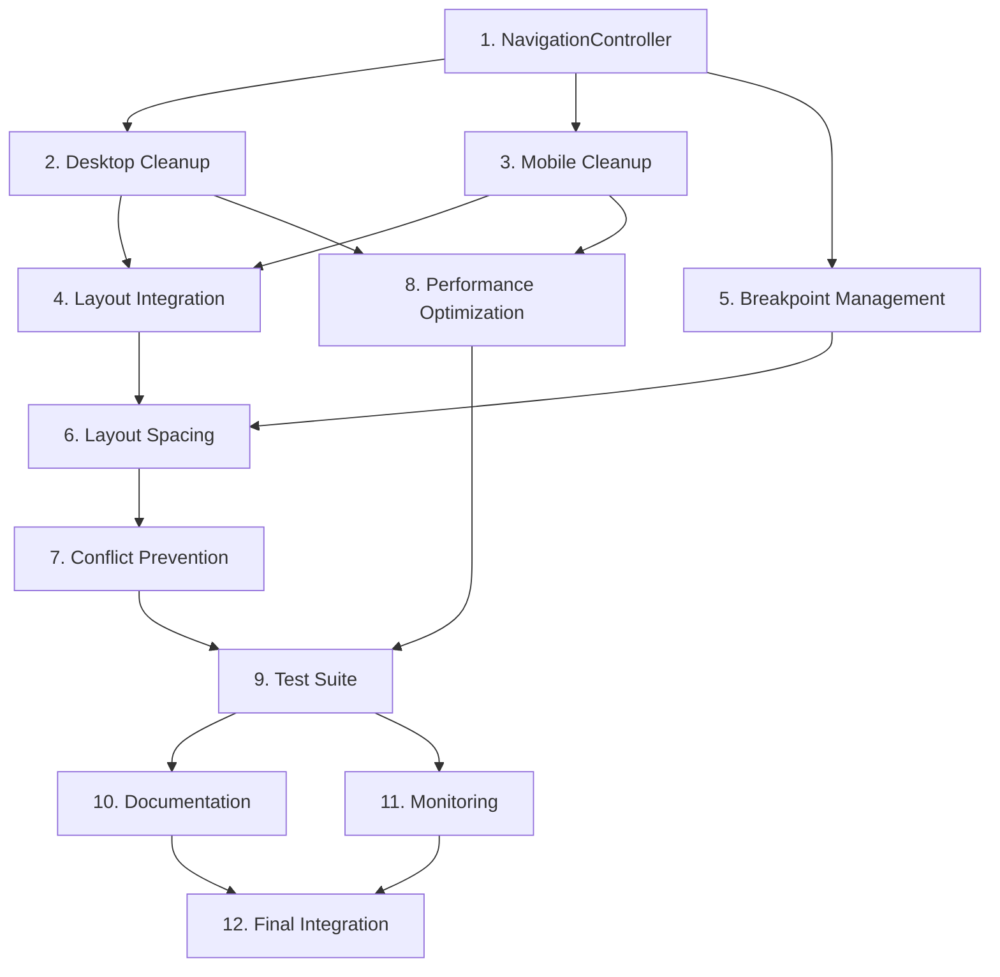

# Mobile Navigation Consolidation - Implementation Tasks

## Task Overview

This implementation plan addresses the mobile navigation conflicts and consolidates the navigation system into a clean, unified architecture. The tasks focus on eliminating navigation component conflicts, improving responsive behavior, and creating a maintainable navigation system that works seamlessly across all device types.

## Implementation Tasks

- [x] 1. Create NavigationController Component

  - Build a smart component that manages navigation type selection based on screen size
  - Implement centralized device detection and breakpoint management
  - Create shared navigation state management for both desktop and mobile components
  - Add component selection logic that ensures only one navigation type is active at a time
  - Implement error handling for navigation component loading and selection failures
  - Write unit tests for device detection, component selection, and state management
  - _Requirements: 1.1, 1.2, 1.3, 1.4, 1.5, 4.1, 4.2, 4.3, 4.4, 4.5_

- [x] 2. Clean Up and Optimize DesktopNavigation Component

  - Remove all mobile-related code and logic from SidebarNavigation.vue
  - Simplify responsive detection to focus only on desktop functionality
  - Ensure the component only renders when screen width is ≥1024px
  - Remove mobile navigation elements (hamburger menus, mobile drawers, bottom navigation)
  - Optimize desktop-specific features like sidebar collapse/expand
  - Clean up CSS classes and remove mobile-specific styling
  - Write tests to verify desktop-only rendering and functionality
  - _Requirements: 2.1, 2.2, 2.3, 2.4, 2.5, 6.1, 6.2, 6.3_

- [x] 3. Clean Up and Optimize MobileNavigation Component

  - Remove all desktop-related code and logic from MobileNavigation.vue
  - Ensure the component only renders when screen width is <1024px
  - Optimize touch targets to meet minimum 44px requirement
  - Implement proper mobile navigation patterns (hamburger menu, drawer, bottom nav)
  - Remove desktop sidebar elements and styling
  - Ensure mobile navigation provides equivalent functionality to desktop
  - Write tests to verify mobile-only rendering and touch-friendly interactions
  - _Requirements: 3.1, 3.2, 3.3, 3.4, 3.5, 6.1, 6.2, 6.3_

- [x] 4. Update AuthenticatedLayout Integration

  - Replace separate desktop and mobile navigation handling with NavigationController
  - Simplify layout logic by removing redundant navigation component management
  - Implement dynamic layout classes based on active navigation type
  - Fix main content area spacing and margins for both desktop and mobile modes
  - Ensure smooth transitions when switching between navigation modes
  - Remove duplicate navigation state management from layout component
  - Write integration tests for layout behavior with different navigation types
  - _Requirements: 5.1, 5.2, 5.3, 5.4, 5.5, 6.1, 6.2, 6.3_

- [x] 5. Implement Robust Breakpoint Management

  - Create consistent breakpoint detection system using standardized breakpoints
  - Implement smooth transitions between desktop and mobile navigation modes
  - Ensure navigation mode switches occur at exactly 1024px breakpoint
  - Add debouncing to prevent rapid navigation switching during window resizing
  - Preserve user state (current page, preferences) during navigation mode transitions
  - Handle edge cases like window resizing, device rotation, and browser zoom
  - Write tests for breakpoint transitions and state preservation
  - _Requirements: 4.1, 4.2, 4.3, 4.4, 4.5, 7.1, 7.2, 7.3_

- [x] 6. Fix Layout and Content Area Spacing

  - Implement dynamic main content margins based on active navigation type
  - Fix desktop content area to properly accommodate sidebar width (collapsed/expanded)
  - Ensure mobile content uses full width with appropriate top/bottom spacing
  - Handle mobile navigation drawer overlay and content interaction
  - Prevent layout shifts and jarring movements during navigation transitions
  - Add CSS transitions for smooth content area adjustments
  - Write tests for content area layout behavior across different navigation states
  - _Requirements: 5.1, 5.2, 5.3, 5.4, 5.5, 7.2, 7.3_

- [x] 7. Implement Navigation Conflict Prevention

  - Add safeguards to ensure only one navigation component is rendered at a time
  - Implement conflict detection and automatic resolution
  - Create fallback navigation when primary navigation fails to load
  - Add error boundaries to handle navigation component failures gracefully
  - Implement logging and monitoring for navigation conflicts and errors
  - Create debugging tools to help identify navigation issues during development
  - Write tests for conflict scenarios and error handling
  - _Requirements: 1.5, 6.4, 6.5, 6.6, 7.4, 7.5_

- [ ] 8. Optimize Performance and Bundle Size
  - Implement code splitting for desktop and mobile navigation components
  - Add lazy loading to only load the necessary navigation component for current device
  - Remove redundant code and dependencies from navigation components
  - Optimize component re-rendering and state updates
  - Implement performance monitoring for navigation loading and transitions
  - Reduce bundle size by eliminating duplicate navigation logic
  - Write performance tests to ensure navigation meets speed requirements
  - _Requirements: 7.1, 7.2, 7.3, 7.4, 7.5, 6.1, 6.2_

- [ ] 9. Create Comprehensive Test Suite
  - Write unit tests for NavigationController component selection logic
  - Create integration tests for navigation switching between desktop and mobile modes
  - Implement visual regression tests to catch navigation conflicts and layout issues
  - Add accessibility tests for both desktop and mobile navigation components
  - Create end-to-end tests for complete navigation workflows across device types
  - Write performance tests for navigation loading and transition speeds
  - Add error scenario tests for navigation failures and recovery
  - _Requirements: All requirements - comprehensive testing coverage_

- [ ] 10. Update Documentation and Clean Up Codebase
  - Update component documentation to reflect new navigation architecture
  - Create usage guides for the unified navigation system
  - Document breakpoint management and responsive behavior
  - Clean up unused navigation components and test files
  - Update component exports and imports throughout the application
  - Add inline code comments explaining navigation logic and architecture
  - Create troubleshooting guide for navigation issues
  - _Requirements: 6.1, 6.2, 6.3, 6.4, 6.5, 6.6_

- [ ] 11. Implement Monitoring and Analytics
  - Add performance metrics collection for navigation usage patterns
  - Implement error tracking for navigation conflicts and failures
  - Create real-time monitoring for navigation component health
  - Add analytics events for navigation mode switching and user behavior
  - Implement alerting for navigation-related errors in production
  - Create dashboards for monitoring navigation system performance
  - _Requirements: 7.4, 7.5, monitoring and observability_

- [ ] 12. Final Integration Testing and Deployment
  - Conduct comprehensive cross-browser testing for navigation behavior
  - Perform thorough device testing (phones, tablets, desktops, different screen sizes)
  - Execute accessibility audit for both navigation types
  - Run performance benchmarks and optimize any bottlenecks
  - Implement feature flags for gradual rollout of new navigation system
  - Create rollback procedures and test rollback scenarios
  - Conduct user acceptance testing and incorporate feedback
  - _Requirements: All requirements - final validation and deployment readiness_

## Task Dependencies

## Priority Levels

### Critical Priority (Must Fix Immediately)
- Task 1: NavigationController Component - Core architecture
- Task 2: Desktop Navigation Cleanup - Fix current conflicts
- Task 3: Mobile Navigation Cleanup - Fix mobile issues
- Task 4: Layout Integration - Fix spacing and layout problems

### High Priority (Should Complete Soon)
- Task 5: Breakpoint Management - Ensure smooth transitions
- Task 6: Layout Spacing - Fix content area issues
- Task 7: Conflict Prevention - Prevent future issues

### Medium Priority (Important for Quality)
- Task 8: Performance Optimization - Improve user experience
- Task 9: Test Suite - Ensure reliability
- Task 10: Documentation - Maintainability

### Low Priority (Nice to Have)
- Task 11: Monitoring - Observability
- Task 12: Final Integration - Polish and deployment

## Acceptance Criteria for Each Task

Each task must meet the following criteria before being marked as complete:

1. **Functionality**: All specified features work correctly across device types
2. **No Conflicts**: Zero navigation component conflicts or overlapping elements
3. **Responsive**: Proper behavior at all screen sizes and breakpoints
4. **Performance**: No performance regression, meets speed requirements
5. **Testing**: Comprehensive tests written and passing
6. **Accessibility**: WCAG AA compliance maintained
7. **Code Quality**: Clean, maintainable code following project standards
8. **Documentation**: Relevant documentation updated

## Estimated Timeline

- **Phase 1** (Tasks 1-4): 3-4 days - Core architecture and cleanup
- **Phase 2** (Tasks 5-7): 2-3 days - Responsive behavior and conflict prevention
- **Phase 3** (Tasks 8-10): 2-3 days - Optimization, testing, and documentation
- **Phase 4** (Tasks 11-12): 1-2 days - Monitoring and final integration

**Total Estimated Time**: 8-12 days

## Success Criteria

The implementation will be considered successful when:

- Zero navigation component conflicts across all device types
- Clean, smooth transitions between desktop and mobile navigation
- Improved performance with reduced bundle size
- All navigation functionality works correctly on both desktop and mobile
- User experience is significantly improved across all devices
- Codebase is cleaner and more maintainable
- Test coverage is comprehensive and reliable
- Documentation is complete and helpful for future development

## Risk Mitigation

### Technical Risks
- **Navigation Conflicts**: Comprehensive testing and conflict detection
- **Performance Regression**: Performance monitoring and optimization
- **Responsive Issues**: Thorough device testing and breakpoint validation

### User Experience Risks
- **Functionality Loss**: Careful feature preservation during refactoring
- **Transition Issues**: Smooth animation and state preservation
- **Accessibility Problems**: Comprehensive accessibility testing

### Deployment Risks
- **Production Issues**: Feature flags and gradual rollout
- **Rollback Needs**: Clear rollback procedures and testing
- **User Disruption**: Minimal downtime deployment strategy