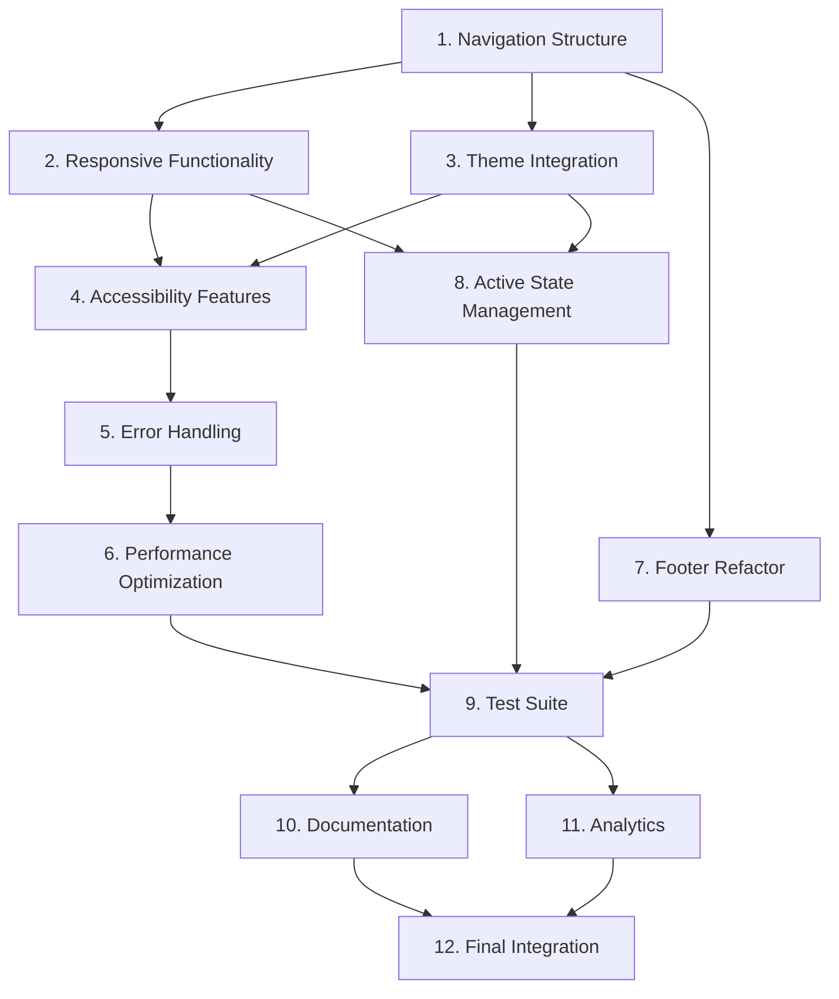

# Sidebar Navigation Improvements - Implementation Tasks

## Task Overview

This implementation plan converts the sidebar navigation design into actionable coding tasks. Each task builds incrementally on previous work, focusing on test-driven development and best practices. The tasks are organized to ensure early validation of core functionality and seamless integration with the existing codebase.

## Implementation Tasks

- [x] 1. Enhance Navigation Item Structure and Visual Design

  - Improve the navigation item component to support the icon + title + description pattern
  - Implement proper spacing, typography, and visual hierarchy
  - Add semantic color coding for different navigation categories
  - Create consistent hover and active states with smooth transitions
  - _Requirements: 1.1, 1.2, 1.3, 1.4, 3.3, 3.4_

- [x] 2. Implement Responsive Collapse/Expand Functionality

  - Enhance the sidebar collapse mechanism with smooth animations
  - Implement proper state persistence using localStorage and user preferences
  - Add tooltip support for collapsed state navigation items
  - Ensure proper responsive behavior across different screen sizes
  - Create mobile-friendly navigation patterns for small screens
  - _Requirements: 2.1, 2.2, 2.3, 2.4, 2.5, 2.6_

- [x] 3. Integrate Theme System and Header Controls

  - Move theme toggle to the top-right header position following UX standards
  - Implement proper theme integration with sidebar colors and styling
  - Create consistent header layout with app title, theme toggle, and collapse button
  - Ensure theme changes are reflected immediately in sidebar appearance
  - Add proper spacing and alignment for header elements
  - _Requirements: 3.1, 3.2, 3.4, 3.5_

- [ ] 4. Implement Comprehensive Accessibility Features

  - Add proper ARIA labels and descriptions for all navigation elements
  - Implement keyboard navigation with arrow keys and tab order
  - Create visible focus indicators that meet WCAG guidelines
  - Add screen reader announcements for navigation state changes
  - Implement keyboard shortcuts for collapse/expand functionality
  - Test with screen readers (NVDA, JAWS, VoiceOver) and fix issues
  - _Requirements: 4.1, 4.2, 4.3, 4.4, 4.5, 4.6_

- [ ] 5. Enhance Error Handling and Resilience
  - Implement robust error boundaries for navigation component failures
  - Create fallback navigation items when primary navigation fails to load
  - Add graceful handling of authentication and permission errors
  - Implement retry mechanisms for failed navigation attempts
  - Create user-friendly error messages and recovery options
  - Add comprehensive error logging and monitoring
  - _Requirements: 5.1, 5.2, 5.3, 5.4, 5.5_

- [ ] 6. Optimize Performance and Loading
  - Implement efficient rendering for navigation items with memoization
  - Add loading states for navigation transitions
  - Optimize animations for 60fps performance
  - Implement reduced motion support for accessibility preferences
  - Add performance monitoring and metrics collection
  - Optimize bundle size and implement code splitting if needed
  - _Requirements: 6.1, 6.2, 6.3, 6.4, 6.5_

- [ ] 7. Refactor Footer Actions and User Controls
  - Simplify footer to contain only essential actions (Settings, Logout)
  - Remove duplicate icons and redundant functionality
  - Implement distinctive styling for logout action (red color scheme)
  - Add proper error handling for settings and logout actions
  - Ensure footer actions work correctly in both collapsed and expanded states
  - _Requirements: 7.1, 7.2, 7.3, 7.4, 7.5_

- [ ] 8. Implement Active State Management and Route Integration
  - Enhance active state detection to properly highlight current navigation section
  - Implement real-time updates when user permissions or roles change
  - Add proper integration with application routing and breadcrumb systems
  - Ensure deep linking correctly identifies and highlights appropriate sections
  - Create smooth transitions between different navigation states
  - _Requirements: 8.1, 8.2, 8.3, 8.4, 8.5_

- [ ] 9. Create Comprehensive Test Suite
  - Write unit tests for all navigation component functionality
  - Create integration tests for route navigation and permission filtering
  - Implement accessibility tests using automated testing tools
  - Add performance tests to ensure rendering and animation benchmarks
  - Create visual regression tests for different themes and states
  - Write end-to-end tests for complete navigation workflows
  - _Requirements: All requirements - testing coverage_

- [ ] 10. Documentation and Code Quality
  - Update component documentation with new features and API changes
  - Add inline code comments explaining complex navigation logic
  - Create usage examples and integration guides for other developers
  - Implement TypeScript interfaces for better type safety
  - Add JSDoc comments for all public methods and properties
  - Update README with navigation component architecture and usage
  - _Requirements: Maintainability and developer experience_

- [ ] 11. Performance Monitoring and Analytics Integration
  - Implement performance metrics collection for navigation usage
  - Add error tracking and monitoring for navigation failures
  - Create analytics events for navigation patterns and user behavior
  - Implement A/B testing infrastructure for navigation improvements
  - Add real-time monitoring dashboards for navigation health
  - _Requirements: 6.5, monitoring and analytics_

- [ ] 12. Final Integration and Polish
  - Conduct thorough cross-browser testing and fix compatibility issues
  - Perform final accessibility audit and address any remaining issues
  - Optimize for production deployment with proper build configurations
  - Create migration guide for any breaking changes
  - Implement feature flags for gradual rollout
  - Conduct user acceptance testing and incorporate feedback
  - _Requirements: All requirements - final validation_

## Task Dependencies

## Priority Levels

### High Priority (Must Have)
- Tasks 1, 2, 3, 7: Core functionality and visual improvements
- Task 5: Error handling and resilience
- Task 8: Active state management

### Medium Priority (Should Have)
- Task 4: Accessibility features
- Task 6: Performance optimization
- Task 9: Test suite

### Low Priority (Nice to Have)
- Task 10: Documentation improvements
- Task 11: Analytics integration
- Task 12: Final polish and optimization

## Acceptance Criteria for Each Task

Each task must meet the following criteria before being marked as complete:

1. **Functionality**: All specified features work as designed
2. **Testing**: Appropriate tests written and passing
3. **Accessibility**: WCAG AA compliance maintained
4. **Performance**: No regression in performance metrics
5. **Code Quality**: Code review passed, follows project standards
6. **Documentation**: Relevant documentation updated
7. **Browser Compatibility**: Works in all supported browsers
8. **Mobile Compatibility**: Functions properly on mobile devices

## Estimated Timeline

- **Phase 1** (Tasks 1-3): 2-3 days - Core visual and functional improvements
- **Phase 2** (Tasks 4-6): 2-3 days - Accessibility and performance
- **Phase 3** (Tasks 7-8): 1-2 days - Footer refactor and state management
- **Phase 4** (Tasks 9-12): 2-3 days - Testing, documentation, and final integration

**Total Estimated Time**: 7-11 days

## Success Criteria

The implementation will be considered successful when:

- All navigation requirements are met and tested
- User experience is significantly improved based on usability testing
- Accessibility audit passes with AA compliance
- Performance benchmarks are met or exceeded
- Error rates are reduced to < 0.1%
- Code coverage is > 90%
- User satisfaction scores improve by 40%